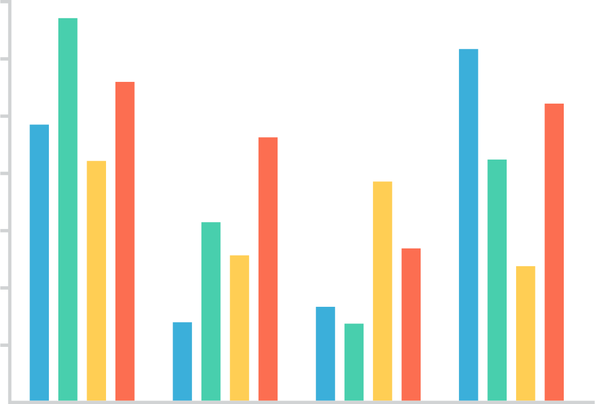

# Markdown Presentation Example
##### Eric Meyer
###### Igalia, March 2021

---

# Titular h1
## Titular h2
### Titular h3
#### Titular h4
##### Titular h5
###### Titular h6

---

This? Fit text! <!-- .element: class="r-fit-text" -->

This is also fit text, which means its size is scaled to fit available space
<!-- .element: class="r-fit-text" -->

There is a limit to how small the text can get when being fit; this causes the text to wrap to a second line, which is the same font size as the first line
<!-- .element: class="r-fit-text" -->

This is _not_ fit text. Compare its size to the previous elements.

---
<!-- .slide: class="igalia-align-left" -->
## Titular h2
+ Create a list by starting a line with `+`, `-`, or `*`
+ Sub-lists are made by indenting 2 spaces or one tab:
	* Ac tristique libero volutpat at
	* Facilisis in pretium nisl aliquet
+ Nulla volutpat aliquam velit
- Marker character changes do _not_ force new list start
+ Very easy!

---

### Titular h3
> This is a blockquote, which is styled to set it apart from normal text but should really only be used when quoting someone at length.  This is a Markdown example, where it is difficult to have a citation.

---

<h3>Titular h3</h3>
<blockquote>
	<p>This is a blockquote, which is styled to set it apart from normal text but should really only be used when quoting someone at length.  This is an HTML example, which can fairly easily have a citation.</p>
	<cite><strong>Author of quote</strong>, cited source</cite>
</blockquote>

---

#### Titular h4
**This is boldface/strong emphasis**

*This is emphasis/italics*

~~This is struck-out text~~

---



This is an SVG image of a chart, which must be pre-made and embedded or included.<!-- .element: class="igalia-text-small" -->

---

<canvas data-chart="line">
	<!--
	{
	"data": {
		"labels": ["January"," February"," March"," April"," May"," June"," July"],
		"datasets": [
		{
			"data":[65,59,80,81,56,55,40],
			"label":"Igalia.com Views","backgroundColor":"rgba(0,103,177,0.8)"
		},
		{
			"data":[28,48,40,19,86,27,90],
			"label":"Revenue","backgroundColor":"rgb(255,153,0,0.8)"
		}
		]
	},
	"options": { "responsive": "true" }
	}
	-->
</canvas>

<p class="igalia-text-small">This is a chart which is dynamically built and animated from source data embedded into the slide.  In this example, the data is in a JSON format.</p>

---

<canvas data-chart="bar">
<!--
{
"data" : {
	"labels" : ["Enero", "Febrero", "Marzo", "Avril", "Mayo", "Junio", "Julio"],
	"datasets" : [{
			"data":[65,59,80,81,56,55,40],
			"label":"Igalia.com Views","backgroundColor":"rgba(0,103,177,1)"
		},
		{
			"data":[28,48,40,19,86,27,90],
			"label":"Revenue","backgroundColor":"rgb(255,153,0,0.8)"
		}]
	}
}
-->
</canvas>

<p class="igalia-text-small">This is another chart which is dynamically built and animated from source data embedded into the slide.  In this example, the data is once again in a JSON format.</p>

---

<canvas data-chart="pie">
,Black, Red, Green, Yellow
My first dataset, 40, 40, 20, 6
</canvas>
<p class="igalia-text-small">This pie chart is dynamically built and animated from CSV data embedded directly into the Markdown.</p>

---

<canvas data-chart="bar">
,2018, 2019, 2020, 2021
Size, 10, 32, 25, 40
</canvas>
<p class="igalia-text-small">This bar chart is dynamically built and animated from CSV data embedded directly into the Markdown.</p>

---

<canvas data-chart="line">
,2018, 2019, 2020, 2021
Project B, 10, 32, 25, 40
Project B, 14, 30, 32, 33
</canvas>
<p class="igalia-text-small">This line chart is dynamically built and animated from CSV data embedded directly into the Markdown.</p>

---

<canvas data-chart="pie" data-chart-src="data/chart-example.csv">>
</canvas>
<p class="igalia-text-small">This pie chart is dynamically built and animated from CSV data found in an external CSV file.</p>


---

#### Titular h4, Tablas:
| Option | Description |
| ------ | ----------- |
| data | path to data files to supply the data that will be passed into templates. |
| engine | engine to be used for processing templates. Handlebars is the default. |
| ext | extension to be used for dest files. |

---

### Ordered list

1. Ordered lists default to left-aligned, which seems sensible
2. If you want the text centered, you might have to hack it
3. Possibilities still to be determined
4. Ordered list markers are 1.2x bigger than the text content in the list item

---

### Unordered list

* Unordered lists default to centering, which is a bit weird
* Consider adding the left-align style to such lists
* Unless this is the effect you’re after
* Unordered list markers are _not_ 1.2x bigger than the text content in the list item

---
<!-- .slide: class="igalia-text-small" -->
#### TITULAR H4


Here’s an example of an image embedded into the slide, demonstrating how Markdown handles such things.

---
<!-- .slide: class="igalia-align-left igalia-text-small" -->
### Two-column text
<div class="igalia-columns">
	<p>This is a paragraph which is enclosed in a <code>div</code> that has a <code>class</code> of <code>igalia-columns</code>, which causes the contents of that <code>div</code> to be rendered using two columns.  At this time, the only built-in option is two columns; to get more than two columns, you need to hack in some CSS.</p>
	<p>It’s possible to have multiple elements inside the two columns.  The contents will be split between the two columns, and browsers will generally try to balance the contents of the columns, though they often bias to the first column.</p>
	<p>It is difficult to flow lists (whether ordered or unordered) into two columns when using Markdown, due to the way the Markdown parser works.  Two-column lists are easy with straight HTML markup: just add the appropriate <code>class</code> value.</p>
</div>

---
<!-- .slide: class="igalia-align-left" -->
# Q&A

<ul class="igalia-qa">
	<li>How are Q&A content handled?</li>
	<li>It’s an unordered list with a <code>class</code> of <code>igalia-qa</code>.</li>
	<li>Can it be done with Markdown instead of HTML?</li>
	<li>So far, not really.  Certainly not easily.</li>
	<li>Shouldn’t this be a definition list instead of an unordered list?</li>
	<li>Let’s not go down that particular rabbit hole of madness right now.</li>
</ul>

---
<!-- .slide: class="igalia-align-left igalia-text-medium" -->
## *Thanks*

*That was a italicized titular H2.  This is an italicized paragraph.  Both are using the single-asterisk pattern.  You can also use underscores to italicize text, if you’re all about that IRC style.*

---

<p class="igalia-message-info">This is what an information message looks like.</p>
<p class="igalia-message-ok">This is what an “OK” or positive message looks like.</p>
<p class="igalia-message-ko">This is what a “KO” or negative/warning message looks like.</p>

---

### Syntax highlighting
Note how the type of code is labeled in the Markdown file.<!-- .element: class="igalia-text-small" -->

``` js
var foo = function (bar) {
	return bar++;
};
// JS comments like so
console.log(foo(5));
```
``` css
h1 {visibility: visible;}
/* CSS comments like so */
::marker {font-size: xx-large;}
```

---
<!-- .slide: class="igalia-text-small" -->
#### Logos Normal


These are 1x-resolution images, which are relative easy to include using Markdown.

---
<!-- .slide: class="igalia-text-small" -->
<h4>Logos Retina</h4>


<p>These are 2x-resolution (or “Retina”) images, which need some sizing in order to not be huge and so are difficult to add using Markdown.  Straight HTML is easier.</p>

---
<!-- .slide: data-middle-cover -->


---
<!-- .slide: data-section-cover -->
# Portada sección

---
<!-- .slide: data-section-cover-2 -->

# Portada sección

---
<!-- .slide: data-background-image="public/bg.jpg" -->

---

<section data-background-image="public/bg2.jpg">
<div class="igalia-wrapper">
	<h3>Thanks</h3>
	<p>Lorem ipsum dolor sit amet consectetur adipisicing elit. Quas repellat aut quos, tempore quasi voluptas</p>
</div>
</section>

---

<section data-background-image="public/bg2.jpg">
<div class="igalia-wrapper igalia-wrapper--alt">
  <p>Image description</p>
</div>
</section>

---
<!-- .slide: data-cover -->


#### Running HTML5-only User Interface on AGL Into the Web Based Homescreen and Applications
##### Lorenzo Tilve
###### Igalia
</section>

---

<h2>The Lorenz Equations</h2>
\[\begin{aligned}
\dot{x} &amp; = \sigma(y-x) \\
\dot{y} &amp; = \rho x - y - xz \\
\dot{z} &amp; = -\beta z + xy
\end{aligned} \]


That’s maths!  The syntax is a little crazy; only include mathematical content if you absolutely must.

---
<!-- .slide: data-background-color="#000" -->
### Video!
<figure class="video_container">
	<iframe src="https://www.youtube.com/embed/enMumwvLAug" width="800" height="450" frameborder="0" allowfullscreen="true">
	</iframe>
</figure>

---

## The End

Any questions?

Ask emeyer@igalia.com for help!
